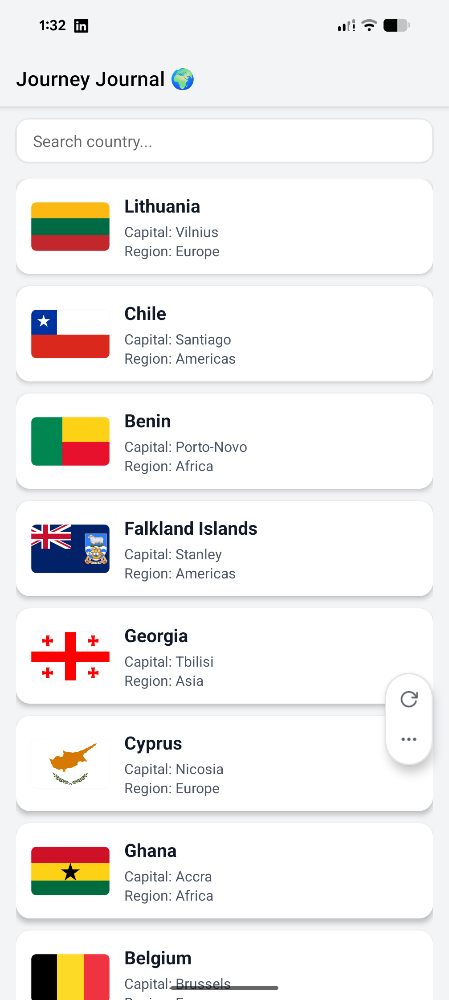
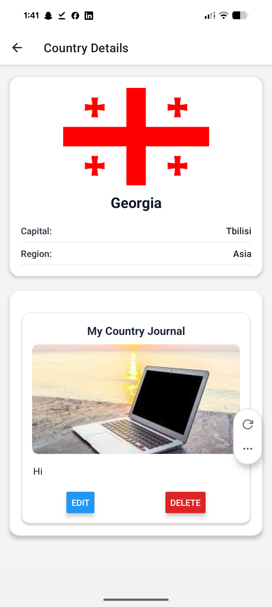
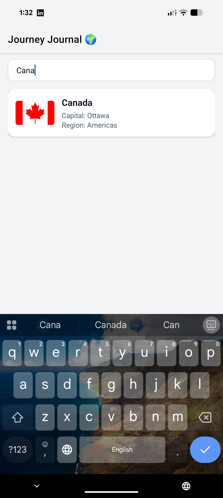

# 🌍 Journey Journal — React Native Mini App

**Journey Journal** is a simple yet elegant mobile app built using **React Native** and **Expo**, where users can explore countries, view their details, and maintain personal journals with photos and notes for each country they “visit.”  

---

## Project Overview
The app fetches country data from the **REST Countries API**, displays them in a searchable list, and allows users to:
- View detailed country info (flag, capital, region)
- Add a photo and write a journal entry for each country
- Save or delete notes locally using **AsyncStorage**
- Enjoy a smooth, keyboard-friendly and responsive UI

---

##  Tech Stack

| Category | Tools / Libraries |
|-----------|-------------------|
| Framework | **React Native (Expo)** |
| Language | **TypeScript** |
| Navigation | **React Navigation (Native Stack)** |
| Local Storage | **AsyncStorage** |
| Image Picker | **Expo Image Picker** |
| Notifications | **react-native-toast-message** |
| Safe Areas | **react-native-safe-area-context** |
| Layout Handling | **KeyboardAwareScrollView**, **KeyboardAvoidingView** |
| API Source | **REST Countries API** (`https://restcountries.com/v2/all`) |

---

##  Core Features

✅ **Searchable Country List**  
Type in the search bar to instantly filter through countries.

✅ **Detailed View**  
Tap a country to view its flag, capital, region, and personal journal section.

✅ **Personal Journal (per country)**  
Add a photo and notes, saved locally for offline access.

✅ **Photo Picker**  
Select or change images directly from your gallery.

✅ **Smooth Keyboard Handling**  
Automatic keyboard dismissal on tap and scroll, ensuring seamless navigation.

✅ **Toast Notifications**  
Clean success, info, and error messages instead of intrusive alerts.

✅ **Safe Area Awareness**  
Layout adjusts to notches and navigation bars on modern devices.

---

##  Installation and Setup

1. **Clone this repository:**
   ```bash
   git clone https://github.com/harpreetdhindsa/JourneyJournal.git
   cd journey-journal
   ```

2. **Install dependencies:**
   ```bash
   npm install
   ```

3. **Run the project:**
   ```bash
   npx expo start
  

4. **Test on your device:**
   - Use **Expo Go** on Android/iOS  
   - Or launch on emulator 

---

## Screenshots


### 🏠 Home Screen


### 🌍 Details Screen

### 🌍 Search Screen

---

##  Common Errors and Fixes

| Issue | Cause | Solution / Learning |
|-------|--------|---------------------|
| **Keyboard required two taps to navigate** | FlatList blocked taps when keyboard open | Added `keyboardShouldPersistTaps="always"` |
| **Content appearing behind notch** | No SafeAreaView used | Wrapped main views in `SafeAreaView` |
| **Flag image stretching** | Used `width: 100%` and `height: auto` incorrectly | Fixed with fixed height and `resizeMode="cover"` |
| **Journal note didn’t lose focus after saving** | Keyboard not dismissed manually | Used `Keyboard.dismiss()` and `ref.current?.blur()` |
| **Alert felt intrusive** | Alerts blocked UI flow | Replaced with `react-native-toast-message` for cleaner UX |
| **Double render flicker on header** | Header styles set inside `useEffect` | Fixed using `useLayoutEffect` (runs before render) |
| **Keyboard covering input field** | ScrollView not aware of keyboard | Used `KeyboardAwareScrollView` for adaptive scrolling |

---

##  Learning Outcomes

1. **React Native Hooks Mastery** —  
   Gained a solid understanding of `useEffect`, `useRef`, `useLayoutEffect`, and how they differ.

2. **Navigation Flow Design** —  
   Implemented stack navigation and passed route parameters (country object).

3. **Persistent Local Storage** —  
   Learned how to use **AsyncStorage** to save and load user data.

4. **Keyboard & UI Management** —  
   Dealt with tricky issues like keyboard overlap and multiple tap behavior.

5. **User Feedback Design** —  
   Replaced native alerts with elegant **toast notifications** for better UX.

6. **Platform Awareness** —  
   Used **SafeAreaView** and **useSafeAreaInsets** for notch and status-bar-aware UI.

7. **Componentization & Clean Code** —  
   Broke down screens into smaller, reusable components (`CountryJournal`, `DetailsScreen`, etc.).

---

##  App Flow Overview

**Home Screen:**  
Displays searchable country list with flag thumbnails.  
↓  
**Details Screen:**  
Shows selected country details.  
↓  
**Journal Section:**  
User adds photo + note → Saved locally → Editable anytime.

---

## Future Improvements

- 🌐 Sync journals with cloud backend (MongoDB)
- 📅 Add “Visited Date” picker
- 📸 Capture photo directly from camera
- 🧭 Add map integration using Leaflet or Google Maps

---


